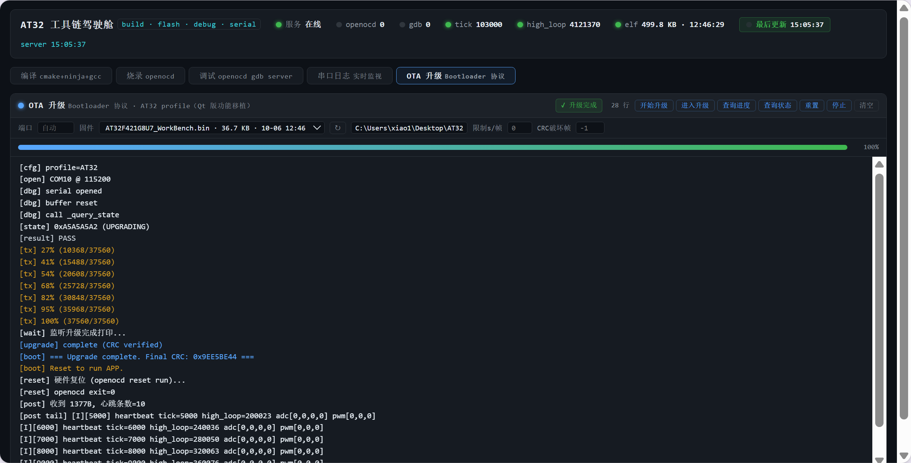
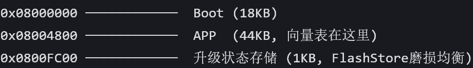
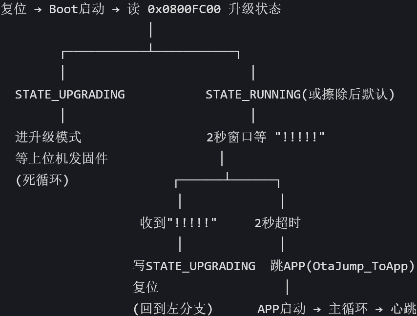

# AT32F421G8U7 BLDC 电调开发台架（Harness_AT32）


无刷直流电机（BLDC）电调开发台架，主控 **AT32F421G8U7**（Cortex-M4F，120MHz，64KB Flash，16KB SRAM）。
电机算法库：`SguanESC/`。图形化配置由 **AT32 Work Bench**（`.ATWP`）生成，其余全部是
**纯命令行开源工具链**：CMake + Ninja + GCC + OpenOCD + GDB，可脚本化、可进 CI、可被 AI 直接操作。

**OTA 能力已平台化移植**：IAP-Bootloader + APP 双区，上位机无 GUI 端到端升级（`cli_flash.py`），
从 STM32 老工程（STM32-OTA-QT）抽出的纯 C 核心库 `ota/core` 双平台共享。

---

## 一、核心能力

### 1. 全 CI 化（push 即构建）
`.github/workflows/build.yml`：每次 push / PR 自动在 Ubuntu 装 ARM 工具链 → 构建固件 →
**校验日志/崩溃符号**（`log_write`/`g_hardfault`/`HardFault_Handler` 必须在固件里）→ 上传 elf 产物。
本地同样一条命令复现：`cmake --preset Debug -DTOOLCHAIN_DIR= -DCMAKE_MAKE_PROGRAM=ninja && cmake --build build/Debug`。

### 2. 可接入 AI，零插件依赖
插件只是"按钮外壳"，背后就是几条命令——本工程把这些命令全部显式化、脚本化：
- 构建 `tools/build.ps1`、烧录 `tools/flash.ps1`、调试 `tools/debug.ps1`、串口 `tools/serial.ps1`
- 所有操作在终端可见、可记录、可回放 → AI（或 CI）可以端到端复现每一步，无需图形界面
- 调试后端 = 开源 cortex-debug + OpenOCD，配置全在 `.vscode/` 且已进 Git
- **可视化驾驶舱** `tools/dashboard.ps1`：编译/烧录/调试/串口/OTA 五面板分页汇到一个网页
  （`http://127.0.0.1:8080`，串口/OTA 走 **serial_bridge 双线代理**：常驻进程独占 COM，
  监视读落盘文件、OTA 走 TCP 透传，互不抢占；OTA 固件可下拉选择）

### 3. 闭环调试能力（编译 → 烧录 → 日志 → 崩溃现场）
| 环节 | 工具 | 能力 |
|---|---|---|
| 编译 | `tools/build.ps1` | 一条命令，FLASH/RAM 占用、全部警告可见 |
| 烧录 | `tools/flash.ps1` | 校验 + 复位运行，换调试器只改 interface cfg |
| 串口反馈 | `tools/serial.ps1` + `log/` | 1s 一条心跳：tick + 高速环计数 + 三相/母线 ADC |
| 崩溃定位 | `crash/crash.c` | HardFault 现场（PC/LR/栈帧/CFSR/BFAR）记录 + 串口打印 + GDB 离线分析 |
| 调试 | `tools/debug.ps1` + GDB | 断点/观察点/寄存器/栈回溯/coredump |

### 4. OTA 升级（平台化移植，M0~M3 完成 + 驾驶舱面板）
- **纯 C 核心库** `ota/core/`：protocol / crc32 / flash_store / upgrade_state / offset / transport，
  零芯片依赖，STM32 老工程与 AT32 新工程共享同一份代码（双构建哈希一致验证）
- **AT32 Bootloader**（`bootloader/` 独立 target，@0x08000000，18KB）+ **APP 重定位**
  （`AT32F421x8_APP.ld`，@0x08004800，44KB + `SCB->VTOR` + 停机保护链 `ota_app_hook`）
- **上位机双 profile**（`config.py`：AT32 / STM32）+ **无 GUI CLI**（`cli_flash.py`）：
  触发 → 逐帧发送（ACK/NAK 重传）→ CRC 校验 → 硬件复位 → 心跳验证，供 CI/AI 自动调用
- **驾驶舱 OTA 面板**（STM32-OTA-QT PyQt6 界面功能 Web 化移植）：
  - 按钮：开始升级（触发+全量/断点续传）、进入升级（仅触发）、查询进度（QUERY_OFFSET）、
    查询状态（QUERY_STATE）、重置（RESET_UPGRADE）、停止（杀进程）
  - 控件：串口端口 / 固件下拉（`/api/firmwares` 扫 build 目录 .bin，可手动填路径）/
    每帧限速 / CRC 破坏帧号 + 进度条 + 状态徽章；未选固件默认主固件
    `build/Debug/AT32F421G8U7_WorkBench.bin`
  - 后端：`dashboard_server.ps1` 动作 `ota_trigger/ota_query_offset/ota_stop`；
    **双线代理**：`serial_bridge.py` 常驻独占 COM（监视读 `logs/serial.live`、
    OTA 走 `--bridge 127.0.0.1:5010` TCP 透传），无交接、无挂起锁，监视与 OTA 互不抢占

---

## 二、架构总览

```
                        ┌────────────────────────────────────────────┐
  上位机(Windows)       │  AT32F421G8U7 芯片 Flash                   │
  ┌──────────────┐      │  ┌──────────────────────────────┐          │
  │ cli_flash.py │──┐   │  │ 0x08000000 Bootloader(18KB)  │          │
  │ (CLI/CI/AI)  │  │   │  │  - 状态机: READY→擦除/SUCCESS→ │          │
  │ config.py    │  │   │  │    跳APP/CRC_FAIL→等'!'重触发/ │          │
  │ (双profile)  │  │   │  │    UPGRADING→断电续传          │          │
  └──────────────┘  │   │  │  - 协议: AA+body+CRC32+55    │          │
    串口(UART1)     │   │  ├──────────────────────────────┤          │
  ┌──────────────┐  └───┼──┤ 0x08004800 APP(44KB)         │          │
  │ 驾驶舱        │      │   │  - BLDC 电机库 SguanESC      │          │
  │ dashboard.ps1│      │   │  - ota_app_hook: '!!!!!'扫描 │          │
  └──────────────┘      │   │    → 停机保护链 → READY      │          │
    串口(UART1)         │  ├──────────────────────────────┤          │
  ┌──────────────┐      │   │ 0x0800F800 OFFSET 页(62)    │          │
  │ OpenOCD+GDB  │──SWD─┼───┤ 0x0800FC00 STATE 页(63)     │          │
  └──────────────┘      │  └──────────────────────────────┘          │
                        └────────────────────────────────────────────┘
  工具链: CMake+Ninja+GCC 13.3.1  |  CI: GitHub Actions(Ubuntu)
  驱动: DAPLink(HID后端)          |  脚本: pwsh7 (统一)
```

---

## 三、目录结构

```
AT32F421G8U7_WorkBench/
├── CMakeLists.txt                # 工程总菜单（APP 源 + bootloader + ota 核心）
├── CMakePresets.json             # 一键参数包（Ninja + toolchain + TOOLCHAIN_DIR + CMAKE_MAKE_PROGRAM）
├── AT32F421x8_APP.ld             # APP 链接脚本（FLASH 0x08004800 / 44KB）
├── cmake/
│   ├── gcc-arm-none-eabi.cmake   # 交叉编译工具链（显式锁编译器 + PATH 回退）
│   └── at32_workbench/           # BSP 子工程（生成代码 + 驱动库）
├── bootloader/                   # 【OTA】Bootloader 独立 target（@0x08000000，18KB）
│   ├── boot.c                    #   状态机 + 协议主循环 + 升级/续传/CRC_FAIL 分支
│   ├── AT32F421x8_BOOT.ld        #   Boot 链接脚本（叠在基础 FLASH.ld 上，REPLACE -T）
│   └── CMakeLists.txt            #   双 -T 处理（string REPLACE 去掉 APP.ld）
├── ota/                          # 【OTA】平台化核心 + 移植层
│   ├── core/                     #   纯 C 核心库（protocol/crc32/flash_store/upgrade_state/offset/transport）
│   └── port/at32/                #   AT32 移植层（flash_hal/usart_hal/delay/printf/jump/ota_app_hook）
├── project/                      # ATWP 生成代码 + 用户钩子区（业务入口）
│   ├── src/
│   │   ├── main.c                # VTOR 重定位 + __enable_irq + OtaAppHook_HandleTrigger
│   │   ├── at32f421_int.c        # USART1 IDLE + DMA 接收（OTA 触发扫描）
│   │   ├── syscalls.c / sysmem.c # 系统支撑（semihosting 规避）
│   └── inc/
│       ├── at32f421_conf.h       # 库配置头
│       └── at32f421_int.h
├── middlewares/                  # 【中间层】硬件驱动之上、业务之下（架构重构后统一收纳）
│   ├── wk_system.c/h             #   系统时钟 / systick
│   ├── wk_usart.c/h              #   串口中间层
│   ├── wk_dma.c/h                #   DMA 中间层
│   ├── wk_adc.c/h                #   ADC 中间层
│   ├── wk_tmr.c/h + wk_tmr15.c/h #   定时器中间层
│   ├── at32f421_wk_config.c/h    #   ATWP 外设配置
│   └── Timer.c/h                 #   板级定时器封装（原 Hardware/）
├── libraries/                    # CMSIS + AT32 标准外设库
├── SguanESC/                     # 电机库（BLDC 算法，勿动）
├── crash/crash.c                 # 崩溃现场记录器（naked 强符号接管 4 个 fault handler）
├── log/log.c + log.h             # 串口日志模块（等级裁剪 + 周期日志 + 时间戳）
├── openocd/
│   ├── interface/cmsis-dap.cfg   # 调试器配置（HID 后端 + cmsis_dap_backend hid）
│   └── target/at32f421xx.cfg     # 芯片配置（SWD / Cortex-M4）
├── svd/AT32F421xx_v2.svd         # 外设寄存器描述（调试用）
├── tools/
│   ├── build.ps1                 # 构建入口（输出落盘 logs/build.log）
│   ├── flash.ps1                 # 烧录入口（输出落盘 logs/flash.log）
│   ├── debug.ps1                 # OpenOCD GDB server 入口（输出落盘 logs/debug.log）
│   ├── serial.ps1                # 串口监视器（自动探测 + 时间戳 + 默认落盘 logs/serial.log）
│   ├── dashboard.ps1             # 驾驶舱启动器（起服务 + 开浏览器）
│   ├── dashboard_server.ps1      # 驾驶舱数据服务（HttpListener，127.0.0.1 安全绑定）
│   ├── dashboard.html            # 驾驶舱前端（编译/烧录/调试/串口/OTA 五路面板 + 全局状态）
│   └── iap_host_tool/            # 【OTA】上位机（自包含, 驾驶舱 OTA 面板后端）
│       ├── cli_flash.py          #   CLI：upgrade/query/reset/trigger/query_offset 五种模式
│       ├── config.py             #   APP_PROFILE（AT32/STM32 双 profile）
│       └── core/                 #   protocol/firmware/iap_worker（移植自 STM32-OTA-QT）
├── logs/                         # 工具链输出日志 + 回归/诊断脚本（git 忽略）
├── docs/                         # 方案 / 学习路线 / 踩坑指南 / 经验总结 / 教程
├── .github/workflows/build.yml   # CI：push 自动构建 + 符号校验 + 产物上传
├── startup_at32f421.s            # 启动文件
└── AT32F421x8_FLASH.ld           # 基础链接脚本（Boot 叠 BOOT.ld，APP 叠 APP.ld）
```

---

## 四、快速开始

```powershell
# 0. 前置：pwsh 7 + DAPLink 已插（COM10 示例；串口/烧录异常先查 openocd 残留进程）

# 1. 构建（等价于插件"编译"）
pwsh -File tools\build.ps1

# 2. 烧录（单固件：APP 或 Boot，见 tools/flash.ps1 -Help；双固件一键见下）
pwsh -File tools\flash.ps1

# 3. 串口观察（心跳日志：tick / 高速环计数 / ADC 采样，Ctrl+C 退出）
pwsh -File tools\serial.ps1 -Port COM10          # 或 -Port 自动探测

# 4. GDB 命令行调试（终端1: server；终端2: gdb 连 :3333）
pwsh -File tools\debug.ps1
arm-none-eabi-gdb build/Debug/AT32F421G8U7_WorkBench.elf
(gdb) target remote :3333

# 5. 可视化驾驶舱（四路日志实时面板，自动开浏览器）
pwsh -File tools\dashboard.ps1                    # → http://127.0.0.1:8080
```

### 双固件烧录（Boot + APP + 状态页）
```powershell
# 完整恢复/首刷：Boot@0x08000000 + APP@0x08004800 + RUNNING 状态页@0x0800FC00
python logs\flash_restore.py
# 等价手动命令（路径必须正斜杠，反斜杠被 openocd 当转义符吞掉）：
openocd -s . -f openocd/interface/cmsis-dap.cfg -f openocd/target/at32f421xx.cfg \
        -c "program build/Debug/bootloader/at32f421_boot.bin 0x08000000 verify exit"
openocd -s . -f openocd/interface/cmsis-dap.cfg -f openocd/target/at32f421xx.cfg \
        -c "program build/Debug/AT32F421G8U7_WorkBench.bin 0x08004800 verify exit"
```

---

## 五、OTA 升级子系统（使用说明）

### 功能演示（驾驶舱 OTA 面板，端到端 PASS）



上图为驾驶舱 OTA 面板完整升级流程：查询状态 `0xA5A5A5A2 (UPGRADING)` → 固件发送 100%（37560/37560）→ `[upgrade] complete (CRC verified)` → Boot 打印 `=== Upgrade complete. Final CRC: 0x9EE5BE44 ===` → `Reset to run APP` → 硬件复位 → 复位后收到 1377B / 心跳 10 条，APP 正常运行（`[I][5000] heartbeat tick=5000 high_loop=200023`）。

**全链路零插件**：触发（APP 停机链）→ Boot 收固件（YMODEM-like 自定义协议）→ CRC32 校验 → 写状态页 → 复位 → Boot 跳 APP（内联汇编原子跳转）→ APP 心跳恢复，全部通过 CMake+OpenOCD+GDB+Python 工具链完成。

### Flash 内存布局与状态机

**Flash 分区（64KB 总容量）**



| 地址 | 分区 | 大小 | 说明 |
|---|---|---|---|
| `0x08000000` | Bootloader | 18KB（0x4800） | IAP 引导程序，独立链接脚本 `AT32F421x8_BOOT.ld` |
| `0x08004800` | APP | 44KB | 业务固件（BLDC 电机库），向量表重定位到此，`SCB->VTOR = 0x08004800` |
| `0x0800F800` | OFFSET 页（页 62） | 1KB | 断电续传：已写页数，上位机查询后从断点续传 |
| `0x0800FC00` | STATE 页（页 63） | 1KB | 升级状态字，**FlashStore 磨损均衡**（一页 256 个 32-bit slot，从后向前扫描取最新值） |

**Boot 状态机流程图**



**状态码**（`ota/core/ota_common.h`）：

| 状态 | 值 | 含义 | Boot 行为 |
|---|---|---|---|
| `STATE_RUNNING` | `0xA5A5A5A0` | 正常运行（或擦除后默认） | 2 秒窗口等 `"!!!!!"` 触发；超时则跳 APP |
| `STATE_UPGRADE_READY` | `0xA5A5A5A1` | APP 请求升级 | 擦除 APP 分区 → 写 `UPGRADING` → 复位 → 进升级模式 |
| `STATE_UPGRADING` | `0xA5A5A5A2` | 正在接收固件 | 进升级模式死循环，等上位机逐帧发送（支持断电续传） |
| `STATE_CRC_FAIL` | `0xA5A5A5A3` | 固件接收完成但 CRC 校验失败 | `while(1)` 等 `"!!!!!"` 重触发，不响应命令帧 |
| `STATE_UPGRADE_SUCCESS` | `0xA5A5A5A4` | 固件校验通过 | 打印 `Upgrade complete. Final CRC: 0x...` → 硬件复位 → 跳 APP |

**状态机关键原理**：
1. **复位即读状态**：Boot 启动第一件事是读 `0x0800FC00` 的最新状态 slot（FlashStore 从页尾向前扫），决定走哪条分支
2. **RUNNING 分支的 2 秒窗口**：正常启动时 Boot 不直接跳 APP，而是等 2 秒看有没有 `"!!!!!"` 触发——这是为了让上位机有机会在 APP 崩溃/起不来时强制进升级模式（不需要按键）
3. **UPGRADING 分支死循环**：进升级模式后 Boot 不再跳 APP，纯靠协议帧收固件；即使断电，下次复位状态仍是 UPGRADING，上位机查 OFFSET 页从断点续传
4. **SUCCESS 后必须硬件复位**：Boot 写完 SUCCESS 后 `while(1)` 死循环（防串口噪声冲写），靠上位机监听 `Upgrade complete` 打印后发 openocd `reset run` 硬件复位，复位后 Boot 读到 SUCCESS → 跳 APP
5. **CRC_FAIL 回退**：CRC 校验失败不自动重传，而是等 `"!!!!!"` 重新触发完整升级（状态回 UPGRADING）

### 协议帧
`SOF 0xAA + TYPE(0x01数据/0x02命令) + [CMD/LEN] + PAYLOAD + CRC32(LE, poly 0xEDB88320) + EOF 0x55`
- 数据帧：TYPE_DATA + len + 载荷 + CRC32 + 55；满 128 字节写一页 Flash
- 命令帧：`QUERY_OFFSET(0x12) / RESET_UPGRADE(0x13) / QUERY_STATE(0x14)`
- 应答：`ACK(0x20){status,seq,pages} / NAK(0x21) / OFFSET(0x22) / STATE(0x23)`

### 端到端升级（CLI，供 CI/AI 自动化）
```powershell
# 前置：config.py 的 APP_PROFILE（默认 STM32，验证 AT32 时改 "AT32"）
cd C:\Users\xiao1\Desktop\STM32-OTA-QT\iap_host_tool
python cli_flash.py --port COM10 \
    --firmware C:\Users\xiao1\Desktop\AT32\AT32F421G8U7_WorkBench\build\Debug\AT32F421G8U7_WorkBench.bin \
    --listen 10 --reset-dir C:\Users\xiao1\Desktop\AT32\AT32F421G8U7_WorkBench
# 流程: 触发('!!!!!'x3 AT32/'!'x10 STM32) → offset → 逐帧(ACK/NAK重传) →
#       Boot 'Upgrade complete. Final CRC: 0x...' → openocd 硬件复位 → APP 心跳 ≥2 → PASS
# 回归参数: --throttle 0.02(限制发送) / --corrupt-frame 100(CRC 破坏→NAK→重传)
```

### M4 全功能回归（部分完成，状态页注入测试法）
```powershell
python logs\m4_regression.py   # T1 查询重置 / T2 断电续传 / T3 CRC破坏 / T4 CRC_FAIL回退 / T5 限制发送
# 已完成: T3 ✅（帧101破坏→NAK→重传→升级完成 CRC 0x9EE5BE44）、T5 ✅（慢速升级）
# 待续: T1/T2/T4（被 DAPLink CDC 假死 + 重插后 Flash 非本工程固件打断，见 docs/踩坑指南.md §31）
```

### Boot 三个反直觉行为（踩坑预警）
1. **置 SUCCESS 后 `while(1)` 死循环**：防串口噪声冲写，命令帧不再响应 → 判定升级完成靠
   监听串口 `Upgrade complete. Final CRC: 0x...` 打印 + **硬件复位**（openocd `reset run`）
2. **固件最后帧必须截断到实际大小**：上位机按 APP_SIZE 填充 0xFF 打包时，最后帧取满 128 字节
   → Boot 的"最后帧不满 128 自动结束"永不触发 → 状态停留 UPGRADING
3. **CRC_FAIL 分支 `while(1)` 等 `'!'` 重触发**：不响应命令帧，重触发靠发 `'!!!!!'`

---

## 六、驾驶舱（可选，纯本地）

`tools/dashboard.ps1` 一键起服务（`127.0.0.1:8080`）+ 打开浏览器：
- **五个实时面板**：编译 / 烧录 / 调试 / 串口日志 / OTA 升级，数据来自 `logs/` 下各脚本的落盘输出（2.5s 轮询）
- **全局状态栏**：openocd / gdb 进程占用、最新心跳（tick / high_loop / ADC）、elf 大小与时间
- **串口面板左右布局**：
  - 左栏 `RX · 设备→PC（文本日志）`：心跳、启动信息等可读文本，支持文本/HEX 两种显示模式
  - 右栏 `TX · PC→设备（嗅探转储 HEX）`：桥主动生成的原始字节流 HEX 转储（`RX: 0x AA BB..` / `TX: 0x..`），与主日志独立存储展示，便于诊断协议/乱码
  - TX 发送框经桥 TX 控制端口（5011）写 COM，发送内容同时进入嗅探转储
- **OTA 面板**：固件下拉选择 / 进度条 / 状态徽章 / 六种操作按钮（开始升级/进入升级/查询进度/查询状态/重置/停止），后端走 `cli_flash.py --bridge 127.0.0.1:5010` TCP 透传
- 每个面板带操作按钮（重编译 / 重烧录 / 刷新串口等）
- 停止服务：`Get-CimInstance Win32_Process -Filter "Name='pwsh.exe'" | Where-Object { $_.CommandLine -like '*dashboard_server*' } | ForEach-Object { Stop-Process -Id $_.ProcessId -Force }`

---

## 七、边缘管理中控平台（规划中，技术选型已定）

**目标**：把驾驶舱（编译/烧录/调试/串口遥测）与 `STM32-OTA-QT` 的 PyQt6 OTA 上位机（固件升级/续传/CRC 模拟）融合为一个**嵌入式边缘管理中控平台**，借鉴 DeepSeek Harness "一切皆插件"的构建方式。

### 选型结论（`docs/边缘管理中控平台-技术选型.md` v0.1）
| 决策点 | 结论 | 理由 |
|---|---|---|
| 平台形态 | **Web 平台**（Python 后端 + 浏览器前端） | 驾驶舱已 Web 化；OTA 核心纯 Python；远程/AI 接入天然 |
| 后端框架 | **FastAPI**（或 aiohttp） | SSE/WebSocket 原生支持（遥测/升级进度推送） |
| 前端 | **原生 JS 延续 dashboard.html** | "简洁美丽"已有先例；面板 = 插件注册的卡片 |
| OTA 上位机 | **核心并入后端，PyQt6 壳丢弃** | `protocol.py`/`firmware.py`/`iap_worker.py` 零 Qt 依赖，直接搬为服务 |
| 插件化 | **轻量 Cordis 式**：manifest + 注册表，三档渐进 | 同构 DSH 理念，不引入重运行时 |

### 现状（诚实标注）
- ✅ **技术选型文档**（2026-10-04，v0.1）
- ⬜ **档 1：FastAPI 后端 + OTA 核心搬入 + 前端 OTA 面板**（未开始）
- ⬜ **档 2：能力插件化**（未开始）｜ ⬜ **档 3：平台化/多设备**（未开始）
- **当前 OTA 升级入口仍是 CLI**：`iap_host_tool/cli_flash.py`（无 GUI，供 CI/AI 自动化）

### 渐进路线（三档，避免一步到位）
| 档 | 内容 | 验收 |
|---|---|---|
| 1（近期） | 后端迁 Python（FastAPI，动作仍 subprocess 调 pwsh 脚本）；OTA 核心搬入服务模块；前端新增 OTA 面板（延续深色风格） | OTA 面板完成真实固件升级；驾驶舱功能零回退 |
| 2（中期） | 插件管理器（manifest 扫描+注册表+依赖）；现有能力改造为插件（build/flash/debug/serial/ota/crash）；配置中心 | 新增插件不改内核即可上线 |
| 3（远期） | 多设备/多芯片档案；事件总线+SSE 全链路；插件远程管理 | 一台中控管 AT32/STM32 多板卡 |

### 待确认问题（详见文档 §8）
远程访问与鉴权、后端 Python 常驻接受度、OTA 面板风格（默认延续深色）、插件粒度（按能力）、Qt 是否保留离线版（默认不保留）。

---

## 八、闭环演示（崩溃定位，插件时代做不到）

```powershell
# 终端1: 起 GDB server
pwsh -File tools\debug.ps1

# 终端2: 故意触发一次 BusFault（PC 指向地址 0 → 指令总线错误）
arm-none-eabi-gdb build/Debug/AT32F421G8U7_WorkBench.elf
(gdb) target remote :3333
(gdb) monitor reset halt
(gdb) set $pc = 0
(gdb) continue

# 串口同时打出崩溃现场：
#   *** CRASH *** pc=0xFFFFFFFE lr=... cfsr=0x1 hfsr=0x40000000 ...
# GDB 里离线分析：
(gdb) p g_hardfault          # 现场结构体（PC/LR/8 寄存器/CFSR/HFSR/MMFAR/BFAR/SP）
(gdb) bt                     # 栈回溯定位崩溃函数
```

---

## 九、CI 说明

- 触发：`push` / `pull_request` 到任意分支
- 流程：Ubuntu → `gcc-arm-none-eabi + cmake + ninja` →
  `cmake --preset Debug -DTOOLCHAIN_DIR= -DCMAKE_MAKE_PROGRAM=ninja`（走 PATH 分支 + 覆盖本机 ninja 路径）→
  build → **符号校验** → upload elf
- **本机 vs CI 差异**：本机 `CMakePresets.json` 硬编码 `TOOLCHAIN_DIR`（GNU-tools-for-STM32）与
  `CMAKE_MAKE_PROGRAM`（at32-tools ninja.exe）保证可复现；CI 用命令行 `-DTOOLCHAIN_DIR= -DCMAKE_MAKE_PROGRAM=ninja`
  **覆盖**（runner 的 apt 工具链 + PATH ninja）——两条命令都能复现同一份固件
- 本地模拟 CI 环境：`cmake --preset Debug -DTOOLCHAIN_DIR= -DCMAKE_MAKE_PROGRAM=ninja && cmake --build build/Debug`

---

## 十、学习文档（重要）

| 文档 | 内容 |
|---|---|
| `docs/STM32-OTA平台化移植到AT32-BLDC可行性方案.md` | OTA 平台化 v1.1 方案（M0~M5 里程碑 + 四决策 + 协议/地址/验收） |
| `docs/学习路线.md` | 从插件到命令行工具链的 commit 式迁移路线（Step 0~6 + 设计决策） |
| `docs/踩坑指南.md` | 真实踩坑记录（§1~§31：编码/调试器接口/串口链路/openocd 占用/CDC 假死/OTA 三坑...） |
| `docs/经验总结.md` | 认知升级与收益清单（含 OTA 平台化九条认知） |
| `docs/cortex-debug教程.md` | F5 调试完整教程（快捷键/外设视图/排障） |
| `docs/边缘管理中控平台-技术选型.md` | Qt 上位机 + 驾驶舱合并的中控平台技术选型 |

---

## 十一、里程碑进度（OTA 平台化 M0~M5）

| 里程碑 | 状态 |
|---|---|
| M0 核心库抽取（ota/core 纯 C 双平台共享） | ✅ 已推（196a7d2） |
| M1 AT32 Bootloader（7/7 验收） | ✅ 已推（c3b410a） |
| M2 APP 集成（VTOR + 停机保护链） | ✅ 已推（791482a） |
| M3 端到端升级（双 profile + CLI） | ✅ 已推（738d2a4） |
| M4 全功能回归（T3/T5 PASS，T1/T2/T4 待环境稳定续跑） | 🔶 部分 |
| M5 工具链/CI 整合（build.ps1 双固件 + 体积断言） | ⬜ 未开始 |

**环境提醒**：DAPLink CDC 假死（openocd 连续连接后串口 0 字节）→ 等 5s + 重开串口恢复；
重插后若串口出现未知 `[alive]` 打印 → 重烧 Boot+APP（`logs\flash_restore.py`）锚定固件身份。
